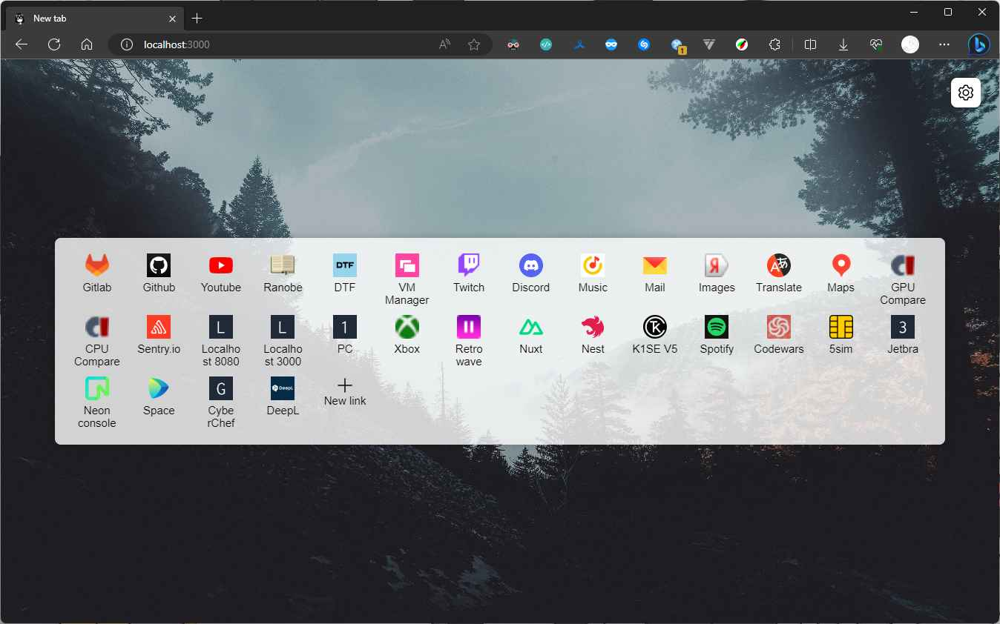
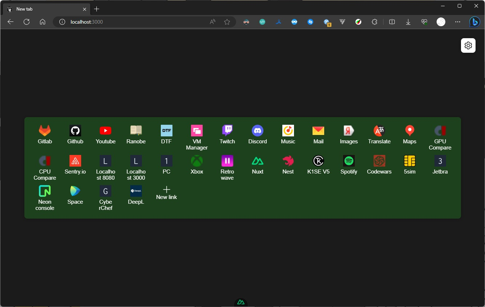
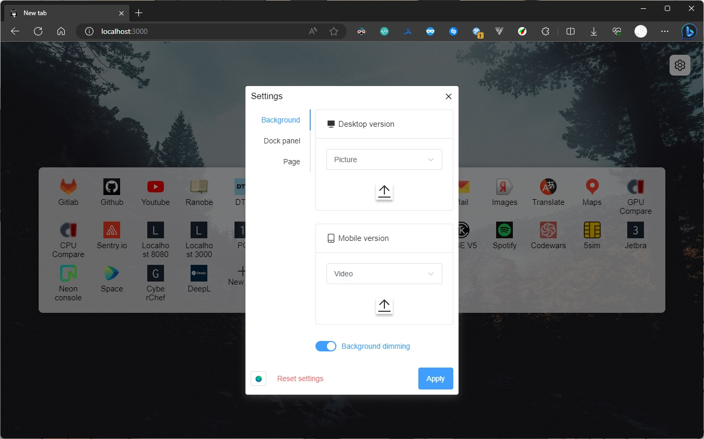
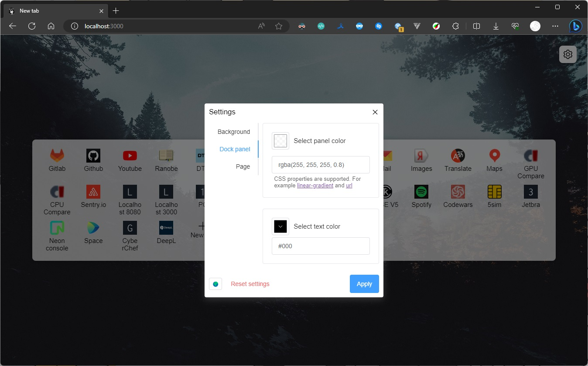
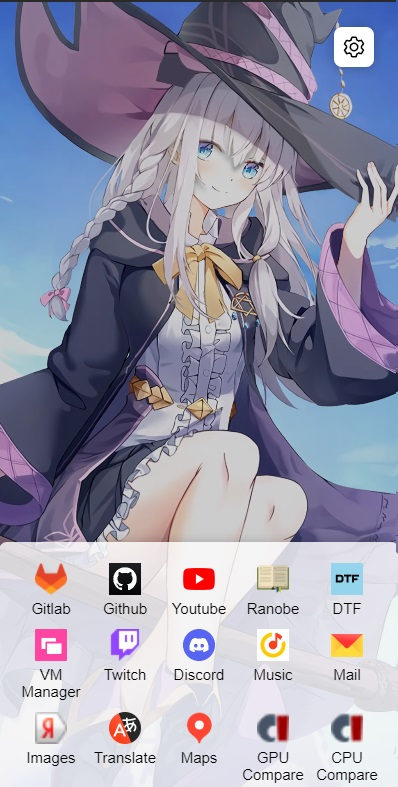
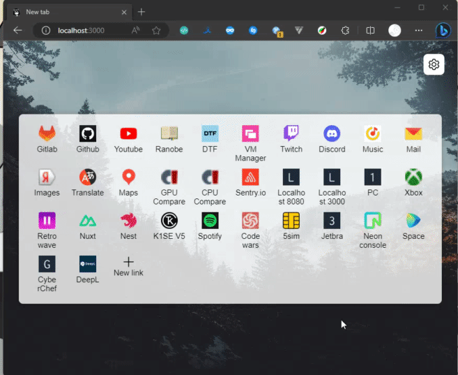

# ArieX Custom Tabpage

<p align="center">
  
  
  
  
  
  
  
  
</p>

**Why?**

- **Synchronization across browsers/devices**: Having my bookmarks in one place allows me to access them from both my PC and phone. While certain browsers like Yandex offer synchronization, it requires using the same vendor's browser on all devices, which doesn't suit my preferences since I use Edge on my PC and Kiwi on my phone for extensions and developer tools. Additionally, if I switch to a different browser, I can easily take my bookmarks with me.

- **Convenience over traditional bookmarks**: Accessing bookmarks on a phone requires opening a separate menu, which involves an extra step. On a PC, they take up limited space at the top. On a custom new tab page, I can fit more bookmarks with larger buttons and icons.

**Features**

1. Automatic icon detection.
2. Flexible settings: Customize the new tab page according to your preferences.
3. Convenient icon container in the mobile version: By default, only the first few icons are shown, but users can scroll to reveal more icons in a container placed close to their fingers.

**Drawbacks**

1. Complex self-hosted installation.
2. Some websites may not allow automatic icon scraping.

**Installation for Ubuntu server**

1. Install NodeJS&NPM: `sudo apt install nodejs`.
2. Clone the repository: `git clone github.com/AriesAlex/ariex-custom-tabpage`.
3. Go to the subfolder: `cd ariex-custom-tabpage`.
4. Build the static files and start the website: `npm run init`.

**Installation for Android**

1. Install Termux from GitHub on your phone.
2. Install NodeJS&NPM: `pkg install nodejs-lts`.
3. Clone the repository: `git clone github.com/AriesAlex/ariex-custom-tabpage`.
4. Go to the subfolder: `cd ariex-custom-tabpage`.
5. Build the static files and start the website: `npm run init`.
6. You can also set a static IP address in your phone's Wi-Fi settings so that it doesn't change.

**Note**: Ensure you have basic Linux knowledge for the installation process. Also you can use `pm2` for it to work in background.

**Then you can set it as default new tab in your browser**:

- In Android Chrome-based browsers you can do it directly in the settings.

- For PC Edge you can try to use `edge-custom-tabpage.reg` file in the repository where you can set your own url.

- For other PC Browsers you can use `Custom New Tab URL` extension.

## Install, build and run

```bash
npm run init
```

## Build

```bash
npm run build
```

## Run

```bash
npm run start
```

Default port: `4554`

You can change port with `PORT` environment variable

## Branches

1.0.0 - legacy vue 2.0 version with dedicated Express server

main - v1.5.0 version on Nuxt 3 with TypeScript, Pinia and SSR

## Credits for default resources

- [Default Image](https://wallhere.com/en/wallpaper/2045715)

- [Default PC Video by Cybust](https://steamcommunity.com/sharedfiles/filedetails/?id=2422159525)

- [Default Mobile Video by Cybust](https://steamcommunity.com/sharedfiles/filedetails/?id=2422160129)
