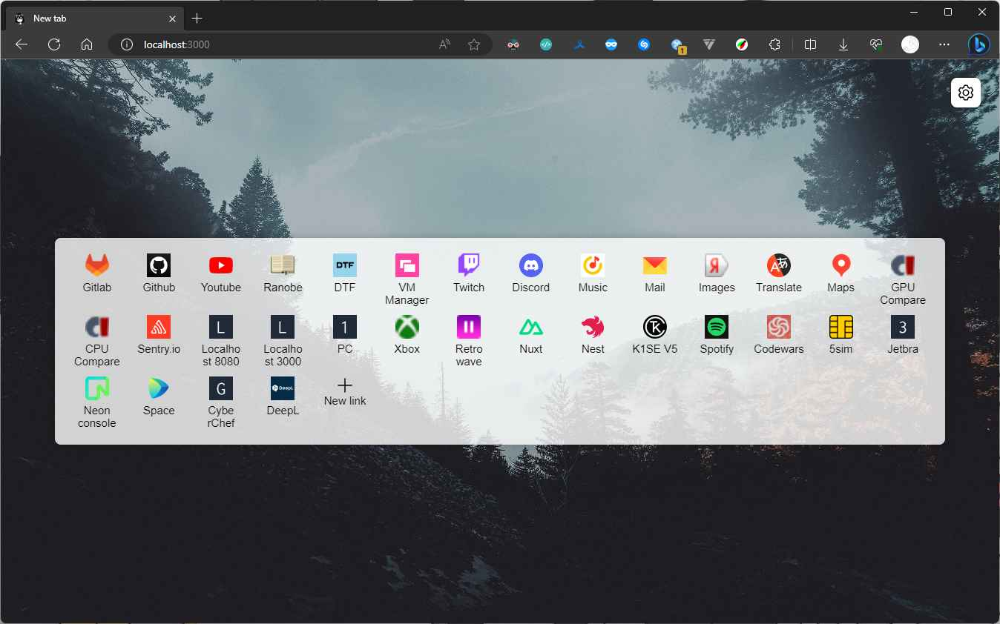
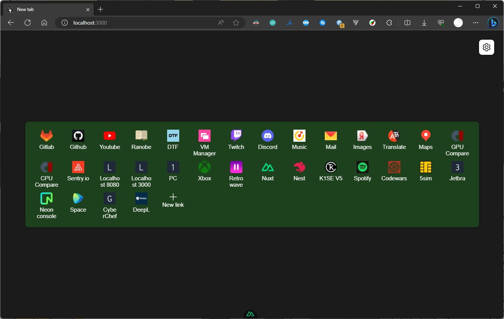
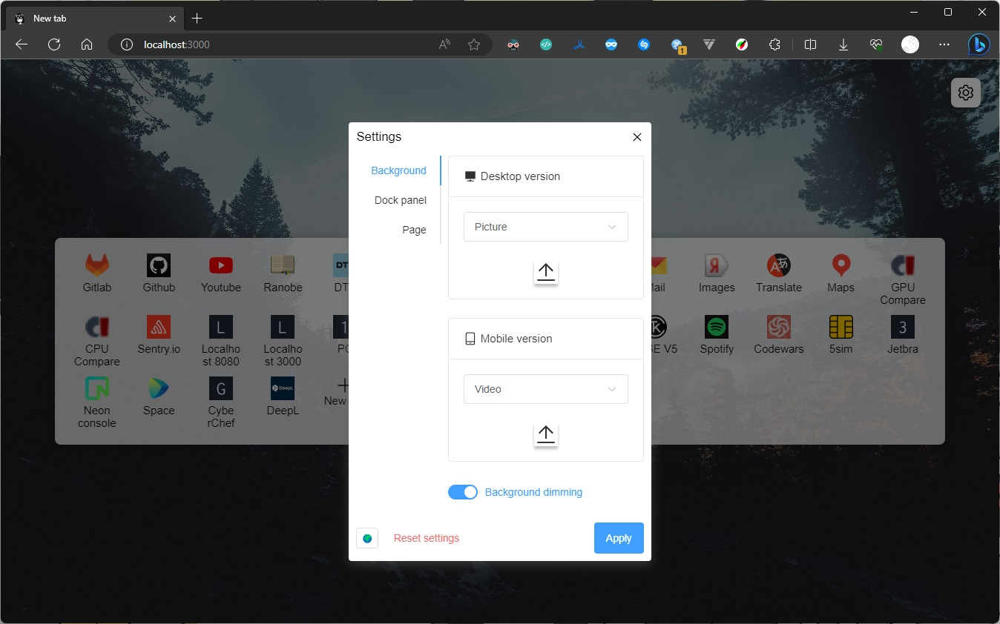
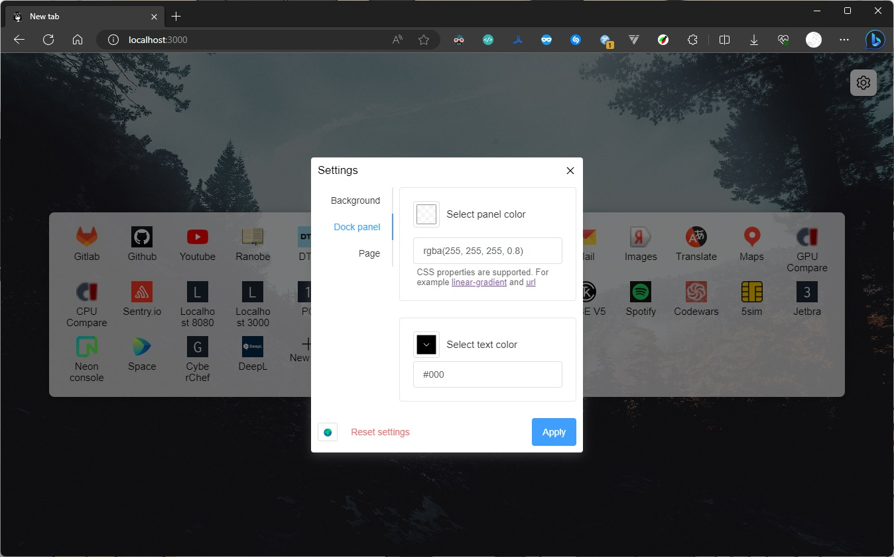
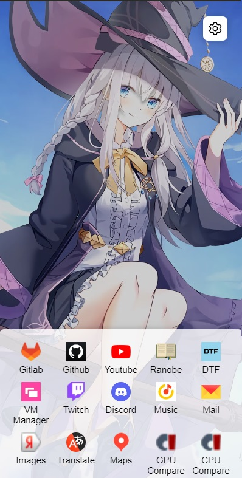

# ArieX Custom Tabpage

<p align="center">
  
  
  
  
  
  
  
</p>

## Why?

- **Synchronization across browsers/devices**: Having my bookmarks in one place allows me to access them from both my PC and phone. While certain browsers like Yandex offer synchronization, it requires using the same vendor's browser on all devices, which doesn't suit my preferences since I use Edge on my PC and Kiwi on my phone for extensions and developer tools. Additionally, if I switch to a different browser, I can easily take my bookmarks with me.

- **Convenience over traditional bookmarks**: Accessing bookmarks on a phone requires opening a separate menu, which involves an extra step. On a PC, they take up limited space at the top. On a custom new tab page, I can fit more bookmarks with larger buttons and icons.

## Features

- Automatic icon detection.
- Custom desktop and mobile image or video backgrounds.
- Configurable dock, colors, dimming, and page loading background.
- A mobile layout that keeps the icon container close to your fingers.
- Optional account mode with isolated links, settings, and media for every user.

## Storage modes

The application remains single-user by default. Without
`MULTI_USER_MODE=true`, it stores links in `links.json`, settings in
`settings.json`, and uploaded media in the built application directory. This is
the original lightweight mode and does not require external services.

With `MULTI_USER_MODE=true`, signing in is mandatory. Every account gets its own
PostgreSQL settings and links and its own objects below
`S3_PREFIX/users/<user-id>/` in S3-compatible storage. Uploaded media therefore
survives application container recreation. The authenticated user's
`pageBackgroundColor` is also applied during server rendering.

Multi-user startup fails if any required PostgreSQL or S3 setting is missing, or
if either service cannot be reached.

## Run with Docker

Single-user mode:

```bash
docker build -t ariex-custom-tabpage .
docker run --rm -p 4554:4554 ariex-custom-tabpage
```

Persist `links.json`, `settings.json`, and `.output/public` with bind mounts if
you use custom media in this mode.

Multi-user mode:

```yaml
services:
  tabpage:
    build: .
    ports:
      - "4554:4554"
    environment:
      MULTI_USER_MODE: "true"
      REGISTRATION_ENABLED: "true"
      SESSION_COOKIE_SECURE: "true"
      DATABASE_URL: ${DATABASE_URL:?set DATABASE_URL}
      S3_ENDPOINT: ${S3_ENDPOINT:?set S3_ENDPOINT}
      S3_REGION: ${S3_REGION:?set S3_REGION}
      S3_BUCKET: ${S3_BUCKET:?set S3_BUCKET}
      S3_ACCESS_KEY_ID: ${S3_ACCESS_KEY_ID:?set S3_ACCESS_KEY_ID}
      S3_SECRET_ACCESS_KEY: ${S3_SECRET_ACCESS_KEY:?set S3_SECRET_ACCESS_KEY}
      S3_PREFIX: ${S3_PREFIX:?set S3_PREFIX}
```

Keep real credentials in a private deployment environment, never in this
repository.

### Multi-user environment

| Variable | Required | Default | Purpose |
| --- | --- | --- | --- |
| `MULTI_USER_MODE` | No | `false` | Enables accounts, PostgreSQL, and S3. |
| `DATABASE_URL` | In multi-user mode | — | PostgreSQL connection URL. |
| `S3_ENDPOINT` | In multi-user mode | — | S3-compatible API endpoint. |
| `S3_REGION` | In multi-user mode | — | S3 region. |
| `S3_BUCKET` | In multi-user mode | — | Existing bucket name. |
| `S3_ACCESS_KEY_ID` | In multi-user mode | — | S3 access key ID. |
| `S3_SECRET_ACCESS_KEY` | In multi-user mode | — | S3 secret access key. |
| `S3_PREFIX` | In multi-user mode | — | Non-empty object key prefix. |
| `S3_FORCE_PATH_STYLE` | No | `false` | Use path-style S3 URLs, useful for MinIO. |
| `REGISTRATION_ENABLED` | No | `true` | Allows creation of new accounts. |
| `SESSION_COOKIE_SECURE` | No | `true` in production | Restricts session cookies to HTTPS. |

The bucket must already exist. Database tables are created automatically on
startup. Back up PostgreSQL independently; account deletion removes the
account's database rows and S3 media.

## Run from source

Node.js 24 and npm are recommended.

```bash
npm ci
npm run build
npm run start
```

The default port is `4554`; override it with `PORT`.

For development:

```bash
npm ci
npm run dev
```

Validation commands:

```bash
npm run typecheck
npm run build
```

## Use as a new tab page

- Android Chromium-based browsers may allow a custom new-tab URL directly in
  their settings.
- For Microsoft Edge, edit and import `edge-custom-tabpage.reg` after setting
  your URL.
- Other desktop browsers can use an extension such as Custom New Tab URL.

Some websites may not allow automatic icon scraping.

## Credits for default resources

- [Default Image](https://wallhere.com/en/wallpaper/2045715)

- [Default PC Video by Cybust](https://steamcommunity.com/sharedfiles/filedetails/?id=2422159525)

- [Default Mobile Video by Cybust](https://steamcommunity.com/sharedfiles/filedetails/?id=2422160129)
